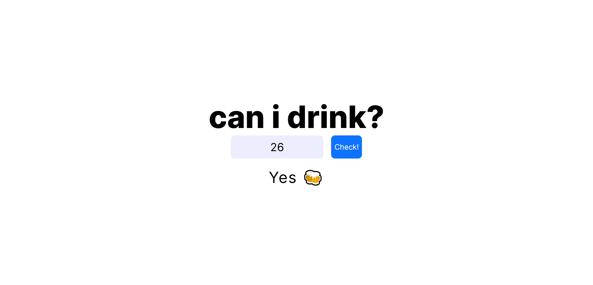

# can i drink?

### [Go Live](https://tadrochlinski.github.io/can-i-drink/)

## Overview
### Instalation
`npm install`  

To Run Test Suite:  

`npm test`  

To Start Server:

`npm start`  

To Visit App:

`localhost:3000/ideas`

### Screenshot

### Built with

- JS
- React (create-react-app)
- CSS / SCSS

### Reflections
I wanted to make simple react app to practice what i learned in tutorials and get the ball rolling 😇